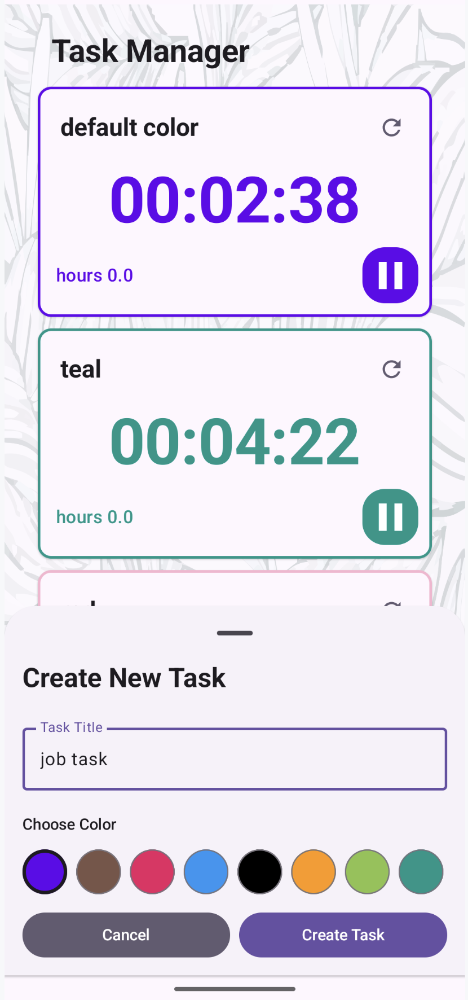
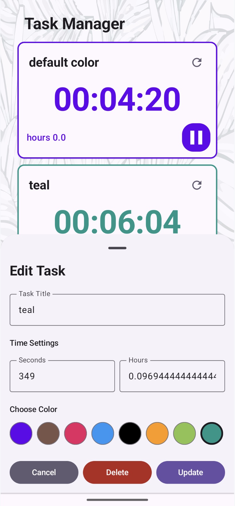

/***
 *If this code runs it was created by Evgenii Sokol.
 *If it doesn't work, I don't know who was created it.
 ***/

<div align="center">

# ⏰ TimeTask

### 🚀 **The Ultimate Cross-Platform Task Timer & Productivity App**

[](https://kotlinlang.org/)
[](https://github.com/JetBrains/compose-multiplatform)
[](https://developer.android.com/)
[](https://developer.apple.com/ios/)
[](https://kotl.in/wasm/)
[](https://openjdk.org/)

**Track time, boost productivity, and manage tasks across all your devices!**

</div>

---

## 🌟 **What Makes TimeTask Special?**

TimeTask is a **modern, cross-platform task timer application** built with cutting-edge technology. Whether you're a developer, designer, student, or professional, TimeTask helps you stay focused and track your productivity across **Android, iOS, Web, and Desktop** platforms.

### ✨ **Key Features**

| 🎯 **Smart Task Management** | ⏱️ **Precise Time Tracking** | 🎨 **Beautiful UI** |
|:---:|:---:|:---:|
| Create, edit, and organize tasks with custom colors | Real-time timer with start/pause/reset functionality | Modern Material Design 3 with smooth animations |
| Intuitive bottom sheet interface | Track time in seconds and hours | Beautiful background with leaf pattern |
| Persistent storage with SQLite | Visual progress indicators | Color-coded task categories |

| 📱 **Cross-Platform** | 🔔 **Smart Notifications** | 🌍 **Multilingual** |
|:---:|:---:|:---:|
| Native performance on all platforms | Background notifications for active tasks | English and Russian support |
| Shared business logic | iOS and Android notification systems | Easy localization system |
| Single codebase, multiple targets | Persistent notification updates | |

---

## 🖼️ **Screenshots & UI Preview**

### 📱 **Main Task Manager Interface**
<div align="center">


*Clean, modern interface with color-coded task timers and intuitive controls*

</div>

### ⏱️ **Active Task Timers**
<div align="center">


*Real-time timer tracking with start/pause functionality and visual progress indicators*

</div>

### ✏️ **Task Creation & Editing**
<div align="center">


*Intuitive bottom sheet for creating new tasks with color selection*


*Comprehensive task editing with time settings and color customization*

</div>

### 🔔 **Smart Notifications**
<div align="center">


*Background notifications keep you informed about active tasks even when the app is closed*

</div>

### 🌍 **Multilingual Support**
<div align="center">


*Full localization support including Russian language interface*

</div>

---

## 🏗️ **Architecture & Technology Stack**

### 🎯 **Modern Architecture**
- **MVI/Redux Pattern** - Predictable state management
- **Clean Architecture** - Separation of concerns
- **Dependency Injection** - Koin for modular design
- **Unidirectional Data Flow** - Easy to test and maintain

### 🛠️ **Technology Stack**

| Layer | Technology | Purpose |
|:---:|:---:|:---:|
| **UI** | Compose Multiplatform | Cross-platform UI framework |
| **State** | StateFlow + Redux | Reactive state management |
| **Database** | SQLDelight | Type-safe SQL with multiplatform support |
| **Networking** | Ktor Client | HTTP client for future API integration |
| **DI** | Koin | Lightweight dependency injection |
| **Notifications** | Platform-specific | Native notification systems |
| **Localization** | Compose Resources | Multi-language support |

### 📦 **Project Structure**
```
TimeTask/
├── 📱 composeApp/          # Main Compose Multiplatform app
├── 🌐 wasmApp/            # Web Assembly version
├── 🔧 shared/             # Shared business logic & database
├── 🖥️ server/             # Ktor backend server
├── 📱 iosApp/             # iOS native wrapper
└── 📸 screenshots/        # UI screenshots for documentation
```

---

## 🚀 **Getting Started**

### 📋 **Prerequisites**
- **Kotlin** 1.9.20+
- **Android Studio** Hedgehog+ (for Android development)
- **Xcode** 14+ (for iOS development)
- **JDK** 11+ (for Desktop/Server)

## 📱 **Platform Support**

| Platform | Status | Features |
|:---:|:---:|:---:|
| 🤖 **Android** | ✅ **Full Support** | Native notifications, Material Design 3 |
| 🍎 **iOS** | ✅ **Full Support** | Native notifications, iOS design patterns |
| 🌐 **Web (WASM)** | ✅ **Full Support** | Progressive Web App ready |
| 🖥️ **Desktop (JVM)** | ✅ **Full Support** | Native desktop experience |
| 🖥️ **Desktop (Native)** | 🚧 **Coming Soon** | Native performance optimization |

---

## 🎨 **Features Deep Dive**

### ⏱️ **Smart Timer System**
- **Real-time tracking** with 1-second precision
- **Start/Pause/Reset** functionality
- **Visual feedback** with color-coded active states
- **Background persistence** - timers continue when app is minimized

### 🎯 **Task Management**
- **Color-coded categories** for visual organization
- **Custom time settings** in seconds and hours
- **Persistent storage** with SQLite database
- **Intuitive editing** with bottom sheet interface

### 🔔 **Notification System**
- **Background notifications** for active tasks
- **Platform-specific** implementation (iOS/Android)
- **Real-time updates** when tasks are modified
- **Non-intrusive** design that respects user preferences

### 🌍 **Internationalization**
- **English** and **Russian** language support
- **Easy to extend** for additional languages
- **Platform-consistent** localization

---

### 📊 **Code Quality**
- **Kotlin coding standards** enforced
- **Material Design 3** guidelines followed
- **Accessibility** considerations implemented
- **Performance** optimized for all platforms

---

## 🤝 **Contributing**

We welcome contributions! Here's how you can help:

1. **🐛 Report bugs** - Use GitHub Issues
2. **💡 Suggest features** - Open a discussion
3. **🔧 Submit PRs** - Follow our coding standards
4. **📖 Improve docs** - Help others get started

### 📝 **Development Guidelines**
- Follow **Kotlin coding conventions**
- Write **comprehensive tests**
- Update **documentation** for new features
- Ensure **cross-platform compatibility**

---

## 📄 **License**

This project is licensed under the **MIT License** - see the [LICENSE](LICENSE) file for details.

---

<div align="center">

### ⭐ **Star this repository if you find it helpful!**

**Made with ❤️ by [Evgenii Sokol](https://github.com/turbosokol)**

*"If this code runs it was created by Evgenii Sokol. If it doesn't work, I don't know who created it."* 😄

</div>